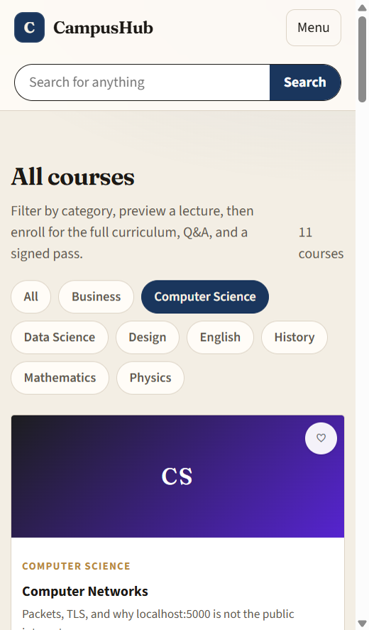
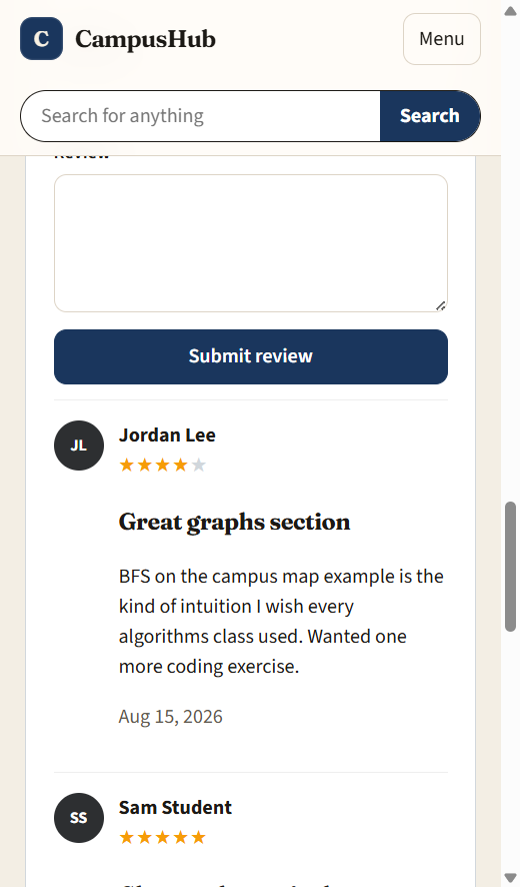
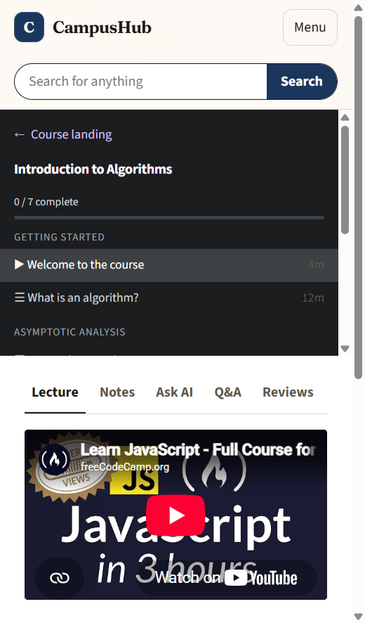
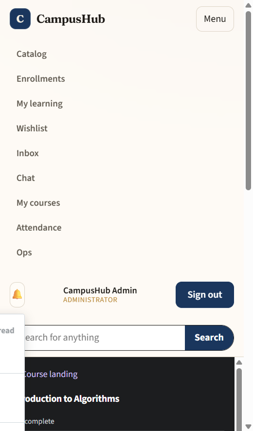

# CampusHub

Production-shaped educational platform: polyglot microservices (.NET + Node.js), event-driven enrollment/payment, Angular micro frontends, Razor admin.

**Phase 6** is in place: identity, gateway/BFF, catalog, enrollment saga, mock payments, notifications, QR/access, Node.js live chat, Razor ops console, Angular MFEs, resilience defaults, Dockerfiles, Kubernetes manifests, and GitHub Actions CI.

High-level diagram and request flows: [docs/architecture.md](docs/architecture.md).

## Spec-driven development

New slices start as a spec, not as ad-hoc code. Constitution: [`.specify/memory/constitution.md`](.specify/memory/constitution.md). Product baseline and backlog: [`specs/000-product/spec.md`](specs/000-product/spec.md).

In Cursor, use the project skills `speckit-specify`, `speckit-plan`, `speckit-tasks`, `speckit-implement`, then `speckit-converge`. “Proceed to next” means the next backlog item in the product spec.

## What runs today

| Service | URL | Role |
|---|---|---|
| Angular shell (via gateway) | http://localhost:5000 | Student/teacher UI |
| Angular dev server | http://localhost:4200 | Shell + MFEs |
| Gateway / BFF | http://localhost:5000 | YARP, cookie session, Razor `/ops` |
| Identity | http://localhost:5101 | OpenIddict (OIDC/OAuth2) |
| Catalog | http://localhost:5102 | Courses and seat reservations |
| Enrollment | http://localhost:5103 | Saga, outbox, compensation |
| Payment | http://localhost:5104 | Mock PSP |
| Notification | http://localhost:5105 | In-app + email (SMS/push stubs) |
| Access | http://localhost:5106 | Signed QR course passes and attendance |
| Chat (Node.js) | http://localhost:5107 | Socket.IO + chat history |

### Seeded users

Password for all: `CampusHub!123`

- `student@campushub.local` — Student
- `teacher@campushub.local` — Teacher
- `admin@campushub.local` — Administrator (Razor ops console)

## Run locally (no Docker)

SQLite is used per .NET service. Chat persists to a local JSON file until Mongo is available. Enrollment outbox publishes events over HTTP until RabbitMQ is available.

```powershell
dotnet run --project src/services/identity/CampusHub.Identity.Api
dotnet run --project src/services/catalog/CampusHub.Catalog.Api
dotnet run --project src/services/enrollment/CampusHub.Enrollment.Api
dotnet run --project src/services/payment/CampusHub.Payment.Api
dotnet run --project src/services/notification/CampusHub.Notification.Api
dotnet run --project src/services/access/CampusHub.Access.Api
npm start --prefix src/services/chat
dotnet run --project src/gateway/CampusHub.Gateway
npm start --prefix src/frontend
```

Open http://localhost:5000. Sign in as **admin** and open **Ops** (or http://localhost:5000/ops) for the Razor operations console: service health, catalog publish/archive, enrollments, and users.

Students and teachers still use the Angular shell. Course chat, QR passes, and inbox are unchanged.

If you already had a browser session from an earlier phase, sign out and sign in again.

## Screens

Snapshots of the current student UI live in [`docs/screenshots`](docs/screenshots).

| Screen | Snapshot |
|---|---|
| Catalog |  |
| Course |  |
| Player |  |
| Notifications |  |

## Search (Meilisearch) and Ask AI

Catalog search uses [Meilisearch](https://www.meilisearch.com/) when it is running, and falls back to SQL if it is not.

```powershell
docker compose -f deploy/docker/docker-compose.yml up -d meilisearch
```

Then restart Catalog (`http://localhost:5102`). Header search and `/catalog?q=` rank by title, subtitle, description, category, and outcomes.

Ask AI is the **Ask AI** tab in the course player. It answers from that course’s materials. Without an API key it quotes the catalog text. To use a model:

```powershell
$env:Ai__ApiKey = "sk-..."
$env:Ai__BaseUrl = "https://api.openai.com/v1"
$env:Ai__Model = "gpt-4o-mini"
```

Any OpenAI-compatible endpoint works (`Ai__BaseUrl`). Do not commit keys.

## Health

- Gateway: http://localhost:5000/health/ready
- Identity: http://localhost:5101/health/ready
- Catalog: http://localhost:5102/health/ready
- Enrollment: http://localhost:5103/health/ready
- Payment: http://localhost:5104/health/ready
- Notification: http://localhost:5105/health/ready
- Access: http://localhost:5106/health/ready
- Chat: http://localhost:5107/health/ready
- Session: http://localhost:5000/whoami (after login)

## Kubernetes and CI

This machine can keep running the local `dotnet`/`npm` loop above. Dockerfiles and manifests are ready for a cluster.

CI (`.github/workflows/ci.yml`) builds the .NET solution, the Angular shell, type-checks chat, and renders `deploy/k8s` with kustomize.

```powershell
# Requires Docker
./deploy/docker/build-images.ps1
kubectl apply -k deploy/k8s
kubectl -n campushub rollout status deploy/gateway
kubectl -n campushub port-forward svc/identity 5101:8080
kubectl -n campushub port-forward svc/gateway 5000:8080
```

Port-forward both identity and gateway so browser OIDC still uses http://localhost:5101 while in-cluster traffic uses Kubernetes DNS (`catalog:8080`, `chat:8080`, …). SQLite (and chat JSON) use `emptyDir` until Postgres/Mongo are wired from `deploy/docker/docker-compose.yml`.
