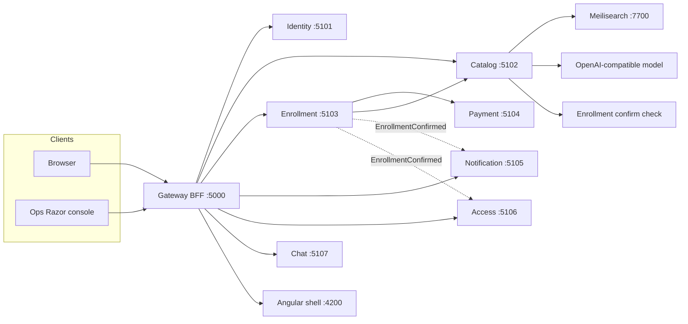
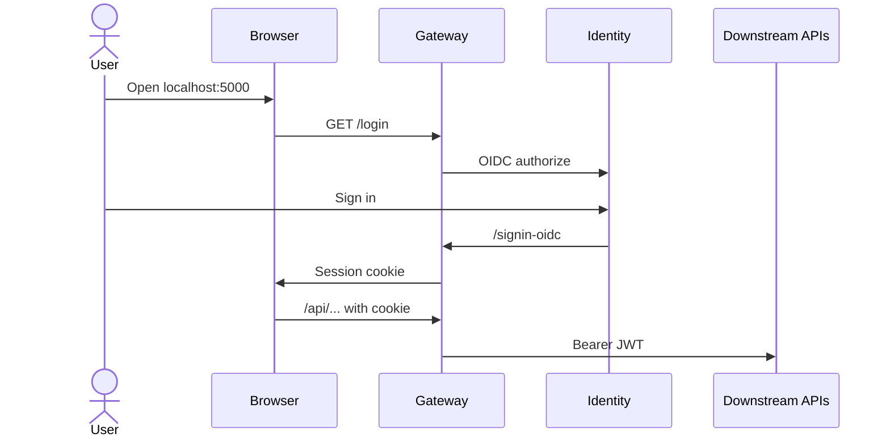
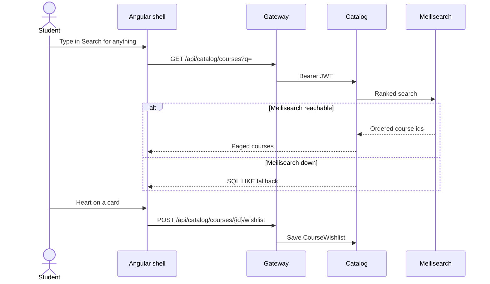
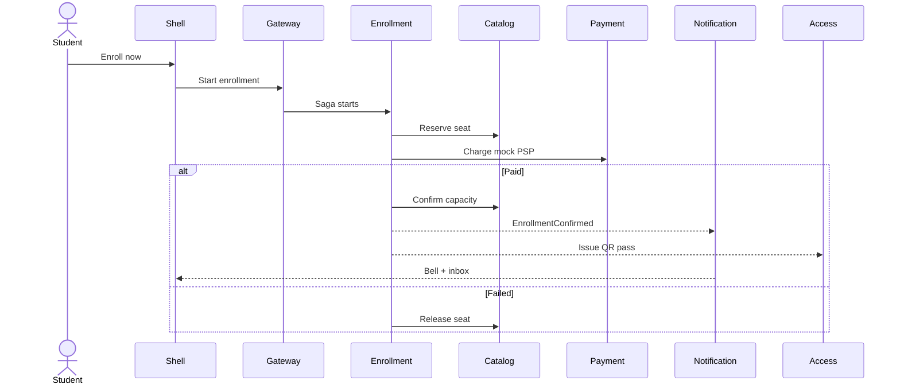
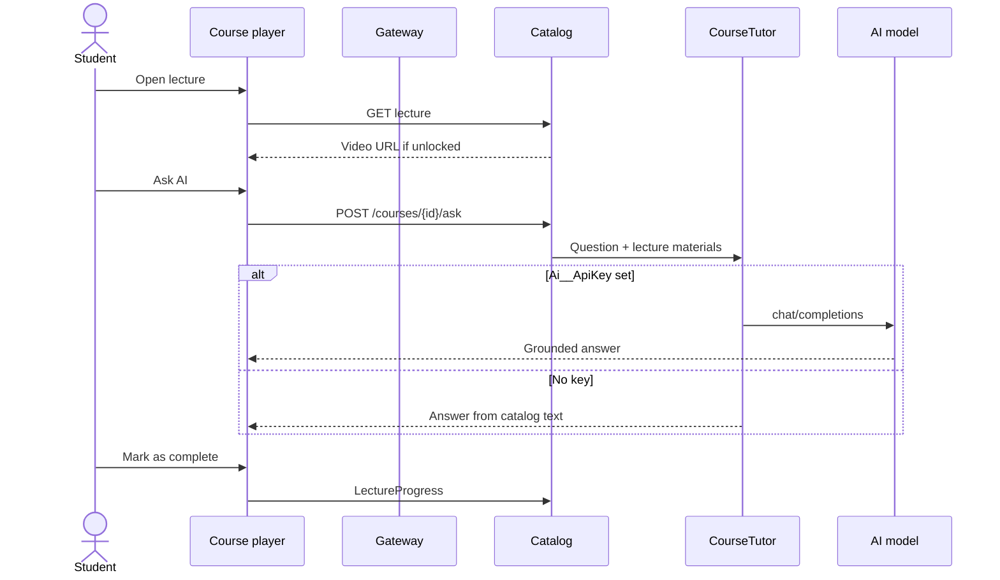

# CampusHub architecture

Living summary of the system. The original planning canvas in Cursor remains the visual companion.

## Goal

A realistic educational platform (courses, teachers, students, enrollments, mock payments, chat, QR, notifications) used to demonstrate senior .NET and distributed-system design — not a set of CRUD microservices.

## High-level view

Students and teachers use the Angular shell. The gateway is the only public edge: it holds the cookie session, talks to Identity for OIDC, and proxies APIs over YARP. Catalog owns courses, search, wishlist, videos, and Ask AI. Enrollment owns the payment saga. Notification and Access react after enrollment is confirmed.

Meilisearch and the AI model are optional. If Meilisearch is down, catalog search uses SQL. If no AI key is set, Ask AI answers from course text.

## Technical flow

### 1. Sign in

The browser never stores an access token. The BFF cookie is the session; YARP attaches JWT to catalog, enrollment, notifications, access, and chat.

### 2. Browse, search, wishlist

Published courses are indexed into Meilisearch on seed, create, update, publish, and archive.

### 3. Enroll and pay

Payment is mock. Notifications and QR are eventual consumers: they do not roll back a confirmed enrollment.

### 4. Learn (video, progress, Ask AI)

Preview lectures are free. Locked lectures hide body and video until enrollment is confirmed (or the caller is the teacher/admin).

### 5. Chat and ops

Chat is Node.js Socket.IO. The BFF cookie is sent to `/socket.io`; YARP forwards JWT. Course rooms require a confirmed enrollment (students) or staff role.

Administrators use `/ops` on the gateway (Razor), not Angular: health, users, categories, catalog, enrollments.

## Phase status

| Phase | Status |
|---|---|
| 0 Foundation (gateway, identity, Aspire, health, tracing) | Done |
| 1 Catalog + Angular shell | Done |
| 2 Enrollment saga + mock payments | Done |
| 3 Notifications + QR | Done |
| 4 Live chat (Node.js) | Done |
| 5 Razor admin + resilience hardening | Done |
| 6 Kubernetes / CI | Done |

## Current runtime

Browser → Gateway BFF (cookie + OIDC + YARP, including WebSockets) → Identity, Catalog, Enrollment, Notification, Access, Chat, Angular shell.

Administrators use a **Razor ops console** at `/ops` (not Angular): live health probes, catalog publish/archive, enrollment list, identity directory. Students/teachers stay on the Angular MFEs.

Resilience: outbound HTTP clients retry with jitter and trip a circuit breaker; APIs return Problem Details on unhandled exceptions; the gateway rate-limits `/api` and `/socket.io`; YARP actively health-checks API clusters; the BFF refreshes access tokens from the refresh token before they expire.

Enrollment/payment is an orchestrated saga. The enrollment outbox publishes CloudEvents-style envelopes over HTTP to notification-service and access-service (same shape as future RabbitMQ consumers). Notifications and QR credentials are eventual: they never roll back a confirmed enrollment.

Access-service issues an HMAC-signed course-pass token after `EnrollmentConfirmed`, renders it as a QR PNG, and records teacher attendance scans. Cancellation revokes the pass.

Chat is a Node.js Socket.IO service. The browser never holds an access token: the BFF cookie is sent to `/socket.io` and `/api/chat`, YARP forwards Bearer JWT, and chat validates JWKS. Course rooms require a confirmed enrollment (students) or staff role (teachers/admins). Persistence is a local JSON file until Mongo is available.

Phase 6 adds container images (`deploy/docker`), a kustomize stack (`deploy/k8s`) with probes and resource limits, and GitHub Actions CI. In-cluster service URLs are injected as configuration; browser OIDC still uses port-forwarded localhost endpoints.

## Target topology

Clients: Angular shell + remotes, Razor admin  
Edge: YARP + BFF  
.NET: identity, catalog, enrollment (saga), payment, notification, access/QR  
Node: chat-realtime  
Search: Meilisearch (optional; SQL fallback)  
AI: OpenAI-compatible tutor on catalog materials (optional; text fallback)  
Data: SQLite locally; PostgreSQL per service, Mongo (chat), Redis, RabbitMQ in later infra  

## Key rules

- Database per service; no shared tables.
- Enrollment + payment is an orchestrated saga with outbox and compensation.
- Notifications and QR are eventual consumers, not saga steps.
- Node.js is used for long-lived sockets, not for domain workflows.
- Search and AI must degrade: the campus demo stays usable without Docker or an API key.

See the repository README for how to run locally, screen snapshots, and how to apply `deploy/k8s`.
